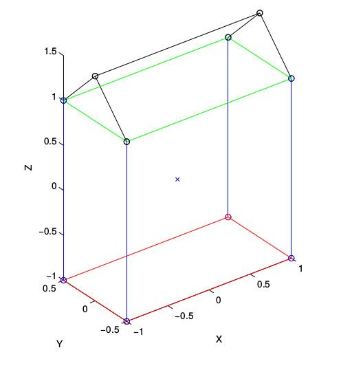
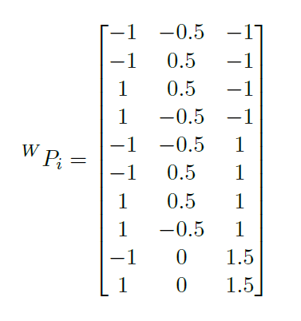
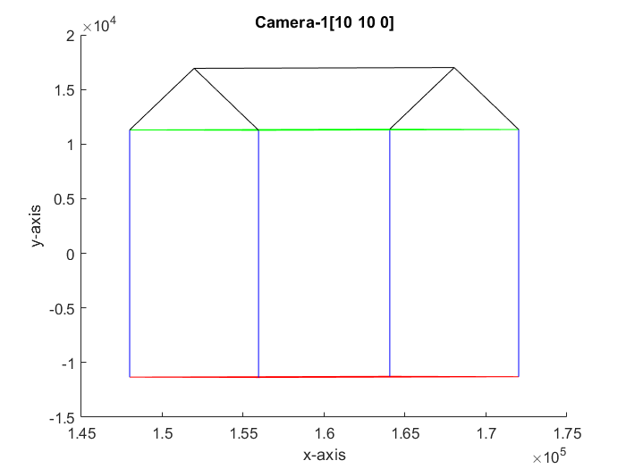
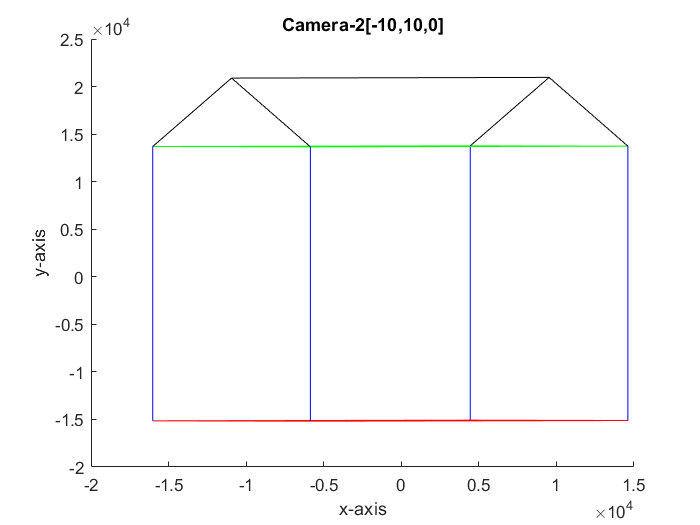
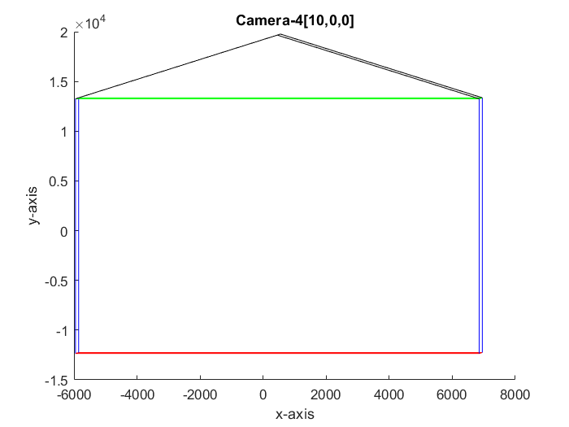
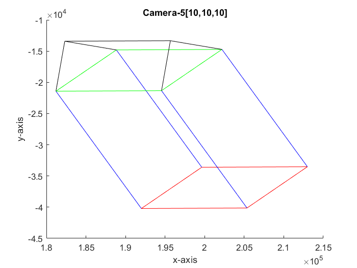

## Objectives:

A simple wireframe house is shown in the Figure above. In this problem, you have to determine the image of the
house as seen by placing the camera at various locations. The camera has scaling factors alpha = beta = 200
units, the image center is at (50; 50), and it has zero skew. The coordinates of vertices of the house in the
world frame are given as,

(a) Write a MATLAB function P C = project points(P W, R, t) that takes as input an N x 3 vector of
points with coordinates in the world frame and returns as output an N x 2 vector of coordinates of points
in the camera frame. R and t are the 3x3 rotation and 3x1 translation matrices from the camera-centric
to world frame.

(b) Write a MATLAB script problem 2.m that uses project points to determine the projection of each
vertex of the house in the image, when the camera is placed at the following positions: (i) [10, 10, 0], (ii)
[-10, 10, 0], (iii) [0, 0, 10], (iv) [10, 0, 0], and (v) [10, 10, 10]. In each case, the camera axis directly passes
through the origin of the world coordinate frame. Display the generated images in a separate window for
each camera location. Plot the lines joining the vertices of the house, as shown in Figure 2 for each of the images. 
You may find it useful to have separate colors for separate lines, and maintain the color scheme
across images. For simplicity you may ignore occlusions, which may occur with a real camera, and simply
display all the lines and vertices.

### Submission Instructions: 
Submit a MATLAB function project points.m and a script problem 2.m that
performs all the operations stated above, along with any other files necessary to run the script. Please take
care to generate all the figures in new windows. You are also required to include the images by embedding
them in the PDF report (do not submit the images separately). Clearly mark the camera location for each
image in the report.

### Outputs

(i) Camera is placed at [10, 10, 0]

-------------------------------------------------------------------------

(ii) Camera is placed at [-10, 10, 0]

-------------------------------------------------------------------------

(iii) Camera is placed at [0, 0, 10]

-------------------------------------------------------------------------

(iv) Camera is placed at [10, 0, 0]

-------------------------------------------------------------------------

(v) Camera is placed at [10, 10, 10]

