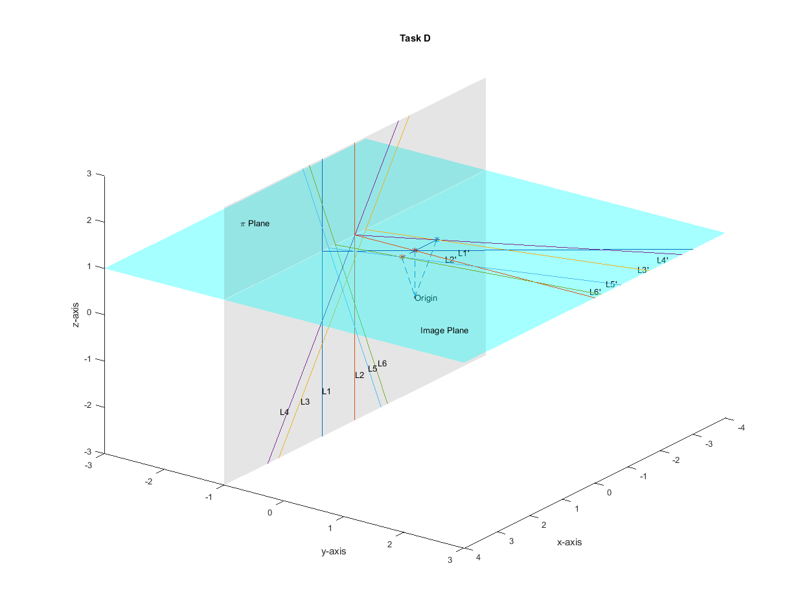

## Objectives:

### (Task A)	

Write a MATLAB function, Q = project point(P) that computes the projection Q on the image plane of a given point P.
Apply this function to each of the given points (i.e. P11, P12, P21, P22, P31 and P32).
    
The projected points Q11, Q12, Q21, Q22, Q31 and Q32 for the given points P11, P12, P21, P22, P31 and P32 keeping center of at the Origin ‘O’ are as follows:

### (Sol. A)

-------------------------------------------------------------------------------------------------------------------------------------------

### (Task B)	

Q = find intersection (P11, P12, P21, P22) that takes as input two points from each line, L1 and L2, and computes the point of intersection Q of the lines projected on the image plane. 
Plot the given lines, their projections, and the point of intersection using MATLAB visualization functions.

### (Sol. B)

-------------------------------------------------------------------------------------------------------------------------------------------

### (Task C) 

Verify that the point of intersection for each pair of parallel lines L1, L2, and L3 is the same by applying the find intersection function to each pair.

### (Sol. C)

Yes, we get the same point Q’ i.e. (0,0,1), evident from the above figure.

-------------------------------------------------------------------------------------------------------------------------------------------
