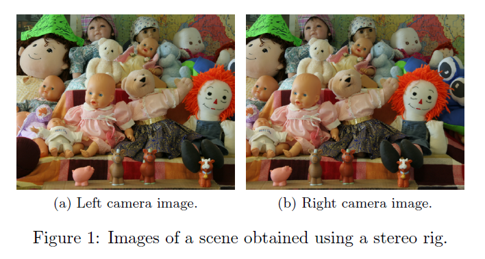
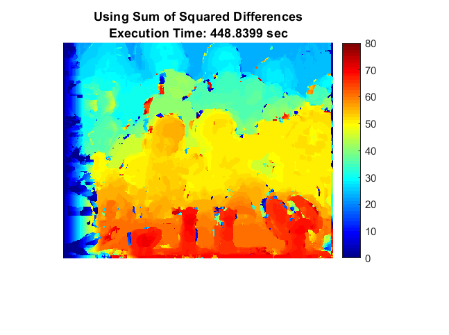
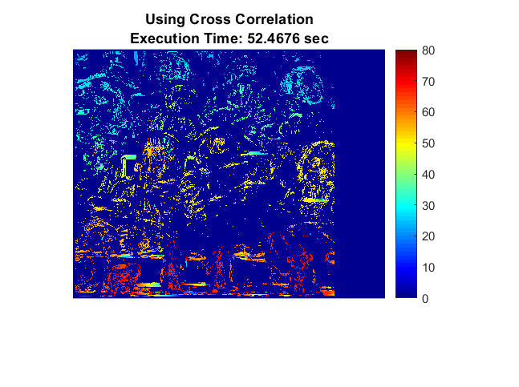
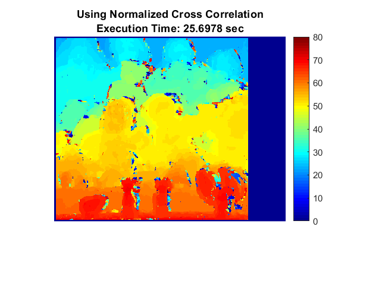

## Objectives:

Figure above shows two images of a scene taken from the left camera (viewL.png) and right camera (viewR.png)
of a stereo system. The images have been rectified and are free from radial distortion. Compare the results
of following algorithms for computing correspondences and generating a disparity map:

* Sum of squared diifferences (SSD)
* Cross-correlation (CC)
* Normalized cross-correlation (NCC)

Note that some of these values must be minimized whereas others must be maximized. You will also need
to experiment with window sizes and decide on a method to disambiguate in case of ties. Report these
decisions as part of your answer. You can use MATLAB functions to convert color images to gray scale.
The ground truth for the disparity (right - left) is provided in the file 'disparity.mat'. Write a MATLAB
function compute corrs that reads in the images and computes the disparity map using each of the three
methods. For each method determine the mean, min, max and standard deviation of the error values using
the ground truth. Also report the running times of each method implemented. Using the above criteria,
report which method is the best.

### Submission Instructions: 
Submit the MATLAB function [disp] = compute corrs(img left, img right,method) that takes as input the left 
and right images and returns a disparity map the same size as img left, for the given method = 'SSD', 'CC','NCC'. 
Submit a MATLAB script 'problem 2.m' along with any other files necessary to run your code. The script must generate 
the disparity maps for each method in separate windows. Include these images along with the error statistics and 
running times in the PDF report. Also include the decisions such as window size, threshold, etc., that you needed to make. 
You must implement your own functions

## Output

Sum of squared diifferences (SSD)

-------------------------------------------------

Cross-correlation (CC)

-------------------------------------------------

Normalized cross-correlation (NCC)

