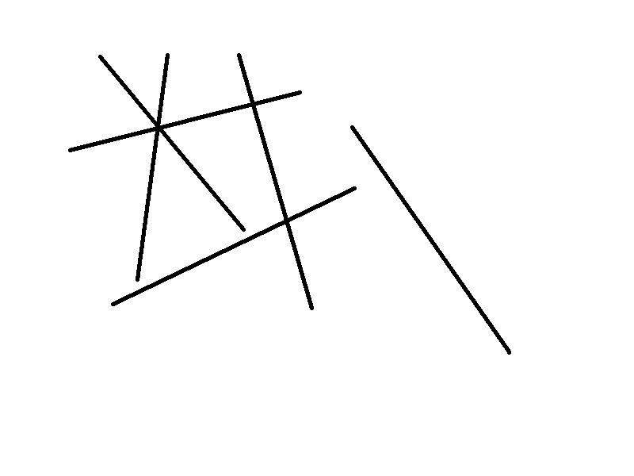
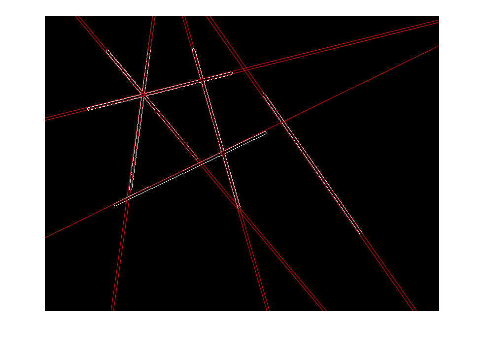

## Objectives:

Write a MATLAB script that implements the Hough transform. It must compute the parameters for all the
lines present in the accompanying image "line.jpg" (shown in Figure 1). You will need to do edge detection
before you apply the Hough transform and may use the MATLAB command edge with the method of your
choice (Canny, Sobel, Roberts). However, you cannot use the MATLAB command hough.

Submission Instructions: Submit a MATLAB script, hough.m, that performs all the operations stated
above, along with any other files necessary to run the script. Using the line parameters computed from
your Hough transform, create a new image by overlaying the detected lines onto the lines in the original
image. You are required to include this image by embedding it in the PDF report (do not submit the image
separately).

### Given Image

### Output

