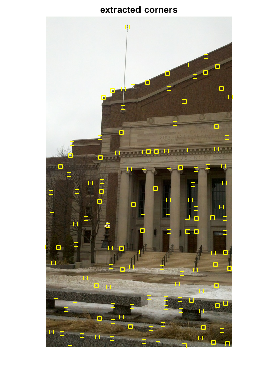
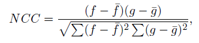
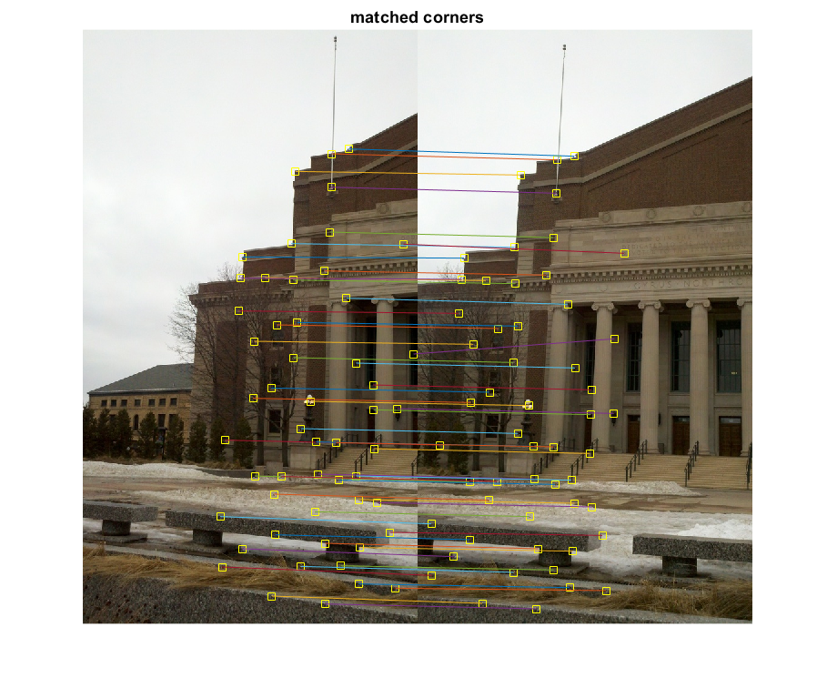
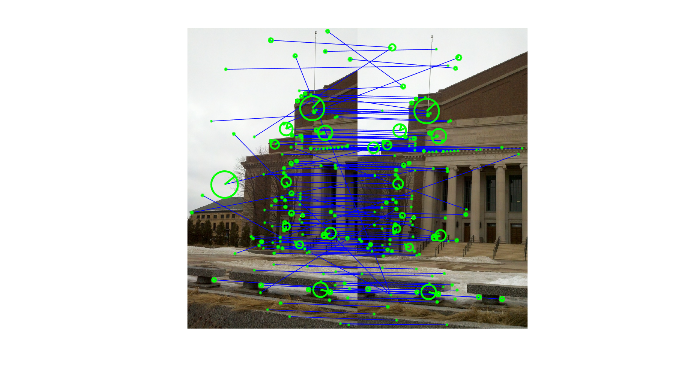
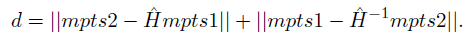
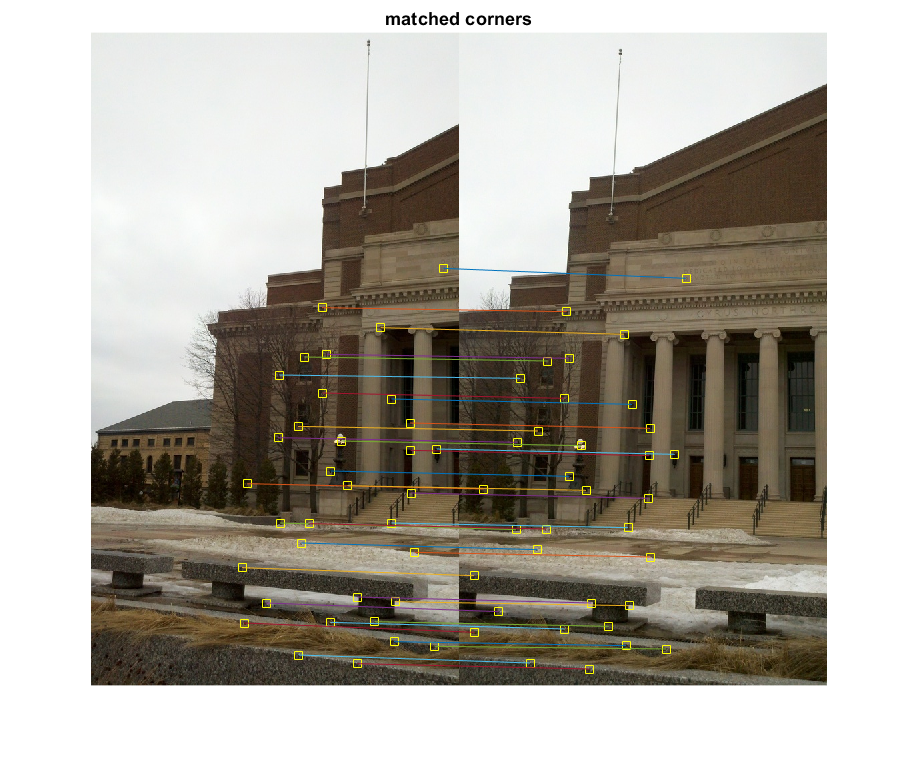

## Objectives:

In this assignment, you will write an image panorama program. Given a set of input images (Figure 1
(a)-(e)), your program must first extract the features, match the features across images, and compute the
homography between them using these features. After applying the homography, you must then blend them
together so that the image boundaries appear smooth and produce a single composite image (Figure 1 (f)).
To do this, follow the procedures outlined below.

-------------------------------------------------------------------------------------------------------------------------------------------

## 1. Feature Detection and Matching

### Problem 1.1 Corner Detection

Write a MATLAB function [pts] = extract corners(img,THRESH) that returns the locations of all corner
points in an image, img, using the Harris corner detection algorithm. Use THRESH as the threshold on the
response value of the detector. pts is a vector containing the locations of all corner points determined
using non-maximal suppression. You may use the MATLAB function imgradientxy to compute the image
derivatives.

### Sol.

 | 
:-------------------------:|:-------------------------:

-------------------------------------------------------------------------------------------------------------------------------------------

### Problem 1.2 Corner Matching

Write a MATLAB function [mpts1,mpts2] = match corners(img1,img2,pts1,pts2,WSIZE) that takes
as input two images, img1 and img2, along with their detected corner locations, pts1 and pts2 (found
using the extract corners function), and a window size, WSIZE. The output of the function will be two
vectors, mpts1 and mpts2, containing the location of corresponding corners in the two images. Specifically,
mpts1 and mpts2 contain the location of the corresponding corners in img1 and img2 found by computing
the normalized cross correlation. The normalized cross correlation is defined as

where f is a corner point in the first image, g is a corner point in the second image, and \bar{f} and \bar{g} are the
mean intensity values within a window of size WSIZE centered at f and g in their respective images. The
NCC is computed for every pair of corner points where the larger the value of the correlation the more
likely that the corner points are matches.

### Sol.

-------------------------------------------------------------------------------------------------------------------------------------------

### Problem 1.3 SIFT Features

Use the vl_sift function from the SIFT toolbox available at www.vlfeat.org to detect the SIFT features
in an input image. Match the obtained SIFT features from two images using the vl ubcmatch function. In
the PDF report, submit two images marking the location of the detected features and the matches found.
You can show the matches using arrows in the two images placed side by side, or mark the position of the
features using text labels on the image. Use the input images `mall1.jpg' and `mall2.jpg' for finding the
features.

### Sol.

-------------------------------------------------------------------------------------------------------------------------------------------

## 2. Homography Estimation

Using the matching points mpts1 and mpts2 found in the previous sub-problems, we can compute the
homography between the input images. In general, the correspondences found may contain a number of
outlier matches. In the presence of outliers, the least squares or RANSAC method can be used to determine
the homography.

### Sol. refer code

### Problem 2.2 RANSAC Method

Write a MATLAB function H = compute homography ransac(mpts1,mpts2,THRESH) that uses the RANSAC
algorithm to reject the outlier matches in mpts1 and mpts2, and then uses only the inliers to find H. Since
H can be computed using four points, at each iteration the of algorithm you must sample four matches and 
use these corresponding pairs to determine the candidate ^H. Use the symmetrical reprojection error as the
distance function to determine the inliers. The symmetrical reprojection error is defined as

Since mpts1 and mpts2 are homogeneous coordinates, you have to normalize ^Hmpts1 and ^H^-1mpts2 before
computing the norm. To decide if a point is an inlier, use THRESH as a threshold for the error. If THRESH is
0, then use 2.5 $$\delta$$ as the threshold where \delta is the standard deviation of the error. Try out diifferent values of
THRESH to see which ones give reasonable performance.

### Sol.

