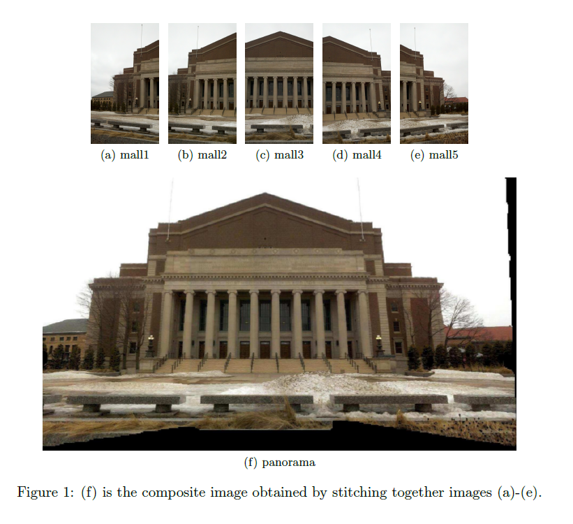
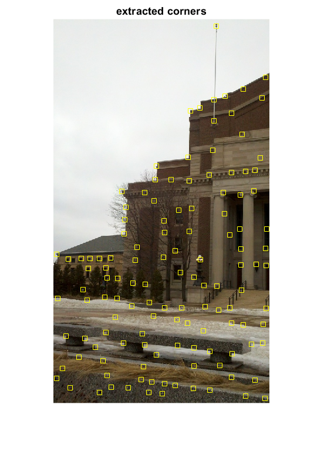

## Objectives:

In this assignment, you will write an image panorama program. Given a set of input images (Figure 1
(a)-(e)), your program must first extract the features, match the features across images, and compute the
homography between them using these features. After applying the homography, you must then blend them
together so that the image boundaries appear smooth and produce a single composite image (Figure 1 (f)).
To do this, follow the procedures outlined below.

-------------------------------------------------------------------------------------------------------------------------------------------

## 1 Feature Detection and Matching

### Problem 1.1 Corner Detection (10 points)

Write a MATLAB function [pts] = extract corners(img,THRESH) that returns the locations of all corner
points in an image, img, using the Harris corner detection algorithm. Use THRESH as the threshold on the
response value of the detector. pts is a vector containing the locations of all corner points determined
using non-maximal suppression. You may use the MATLAB function imgradientxy to compute the image
derivatives.

### Sol.

-------------------------------------------------------------------------------------------------------------------------------------------

