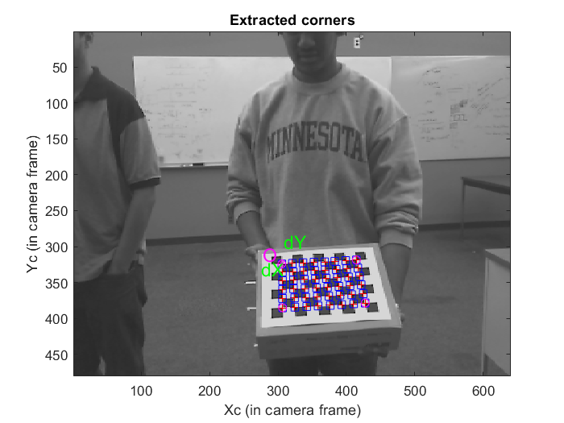
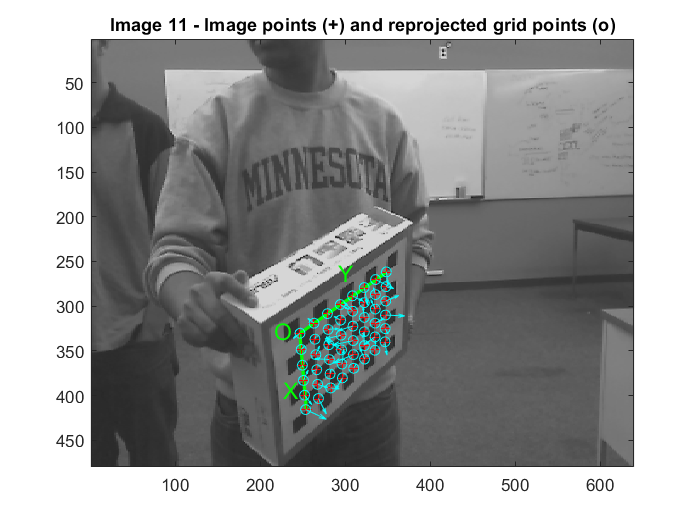
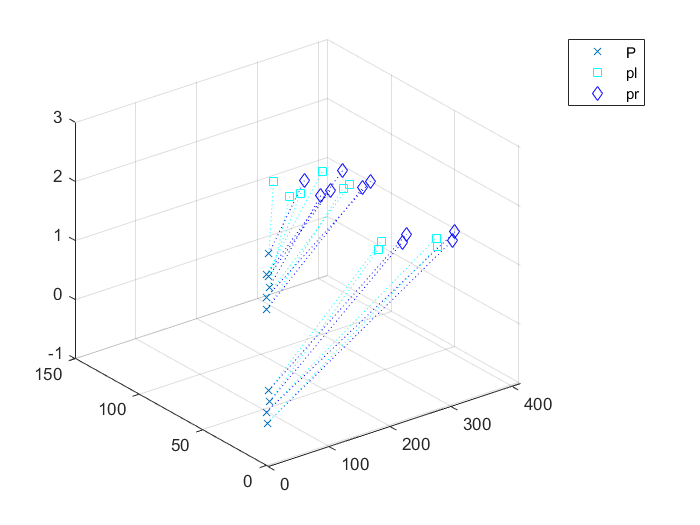
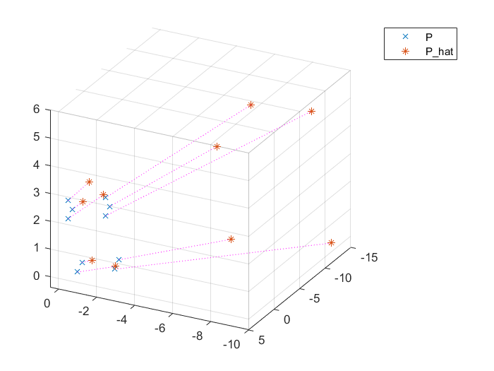
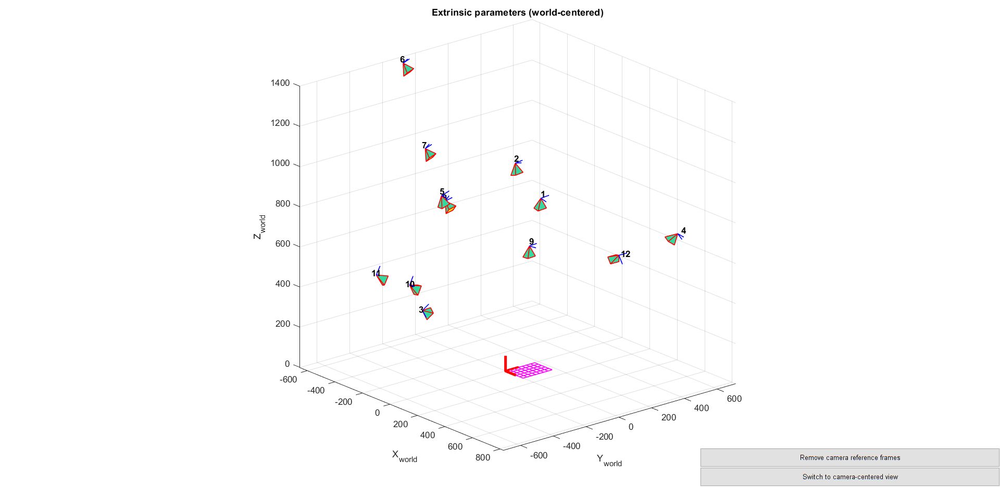
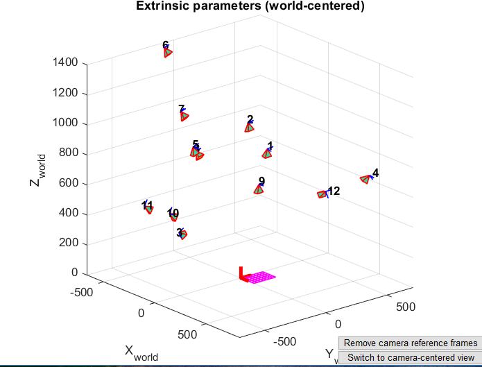
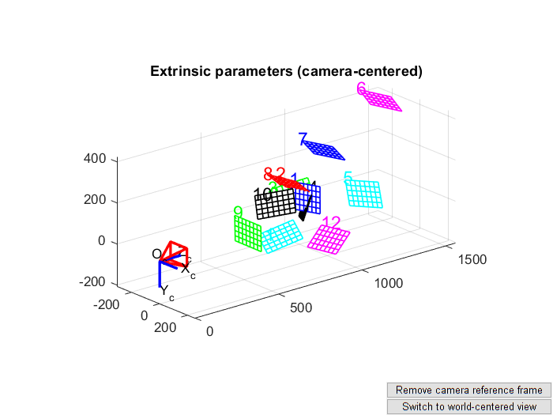
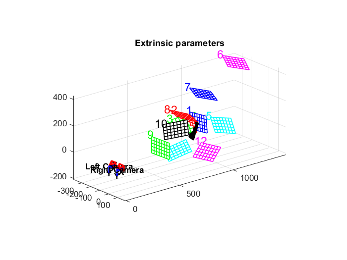

# Computer-Vision-Projects

### These are the computer vision projects which I took in Spring 2019, taught by Dr William Beksi. I thoroughly enjoyed all the assignments and the material taught in class.

### I have listed some of the assignments, which I implemented during that class, in this repository.

** *All the assignments are in MATLAB*

1. 3D point projection
2. 3D object projection
3. Depth estimation through disparity matrix
4. Hough Transform
5. Image Panaroma

 | 
:------------------------------------:|:------------------------------------------:
 | 
 | 
 | 
